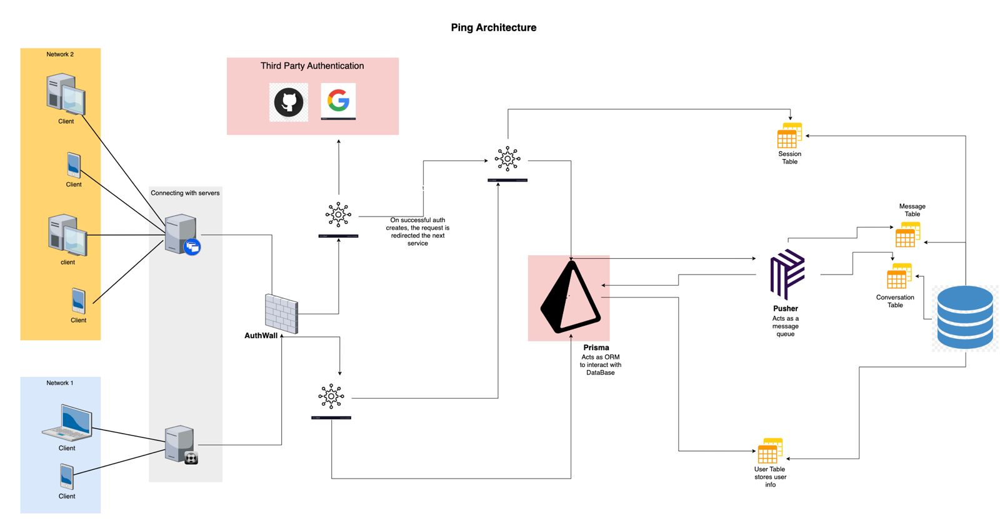

## System Design : Ping

## 1. Introduction

The System Design Document is a roadmap detailing the architecture, functionality, and components of the proposed system. Users can communicate textually in real time via the system in group chat and personal chat settings.It serves as a foundational guide for developers and stakeholders, ensuring a clear understanding of the system's structure and technology choices for successful implementation. This document is essential for aligning the development process with project goals and stakeholder expectations.

## System Architecture for "Ping"

### Frontend:
 
- Next.js: Utilized for server-side rendering, providing a fast and optimized user experience.
- Tailwind CSS: Employed for efficient styling, ensuring a clean and customizable design.

### Backend:

- Node.js: Powers the backend server, offering a non-blocking, event-driven architecture for optimal performance.
- Express.js: Used as the web application framework to simplify routing and middleware implementation.
- MongoDB: Chosen as the database for its flexibility and scalability, storing user profiles, chat history, and other relevant data.

### Authentication:

- Google and GitHub APIs: Integrated for secure and streamlined user authentication, allowing users to sign in using their - Google or GitHub accounts.
- User Registration

### Real-time Communication:

- Pusher: Implemented for real-time chat functionality, enabling instant message delivery and updates across all connected users.

### Overall Workflow:

#### User Authentication:

- Users authenticate using their Google or GitHub accounts through the respective APIs.
Authenticated users gain access to personalized profiles and chat features.

#### Database Management:

MongoDB stores user profiles, chat messages, and related data.
Ensures efficient retrieval and storage of information.

#### Real-time Chat:

Pusher facilitates real-time communication by broadcasting messages instantly to connected users.
Group chat and personal chat functionalities are seamlessly integrated.

#### Frontend Interaction:

Next.js dynamically render and update the user interface based on real-time data.
Tailwind CSS ensures a responsive and visually appealing design.

#### Key Components:

Authentication Module: Manages user sign-in, profile creation, and access control.
Database Connector: Interfaces with MongoDB for data storage and retrieval.
Real-time Messaging Service: Utilizes Pusher for instant message broadcasting.
Frontend Components: Next.js, and Tailwind CSS collectively build the user interface for a smooth and intuitive experience.
This system architecture ensures a scalable, secure, and responsive chat application, integrating the strengths of Next.js, Tailwind CSS, Node.js, Express.js, MongoDB, Google, GitHub APIs, and Pusher to deliver an optimal user experience.

#### Database (MongoDB):

Stores user information, chat messages, and group details
Ensures data persistence and retrieval

## 3. Data Design

### 3.1 Database Schema

The MongoDB database includes collections for users, personal chats, and group chats.

### 3.2 Data Flow

- Users send messages via the client-side application.
- The server processes and broadcasts messages using connections established by Pusher.
- Messages are stored in MongoDB for persistence.

## 4. Technology Stack

### Frontend:
-- Next.js
- Tailwind CSS

### Backend:

- Node.js
- Express.js
- Prisma
- Pusher
- MongoDB
- NextAuth

## 5.  System Interfaces

### 5.1 User Interfaces

- Personal Chat Interface
- Group Chat Interface
- Edit Profile Interface
- Delete Chat Interface
- Login Interface

### 5.2 API Interfaces

- Pusher API for real-time communication
- Google API for Authentication
- Github API for Authentication
- RESTful API for user and chat data
- MongoDB API for Database

## Data Security

- Encryption for data in transit using HTTPS.
- MongoDB security measures for data at rest.

## Performance Considerations

- Used Pusher communication for low-latency messaging.
- Scalability considerations for handling increased user and chat volumes

## Conclusion

In conclusion, the system design for "Ping" ensures a seamless and engaging experience for real-time personal and group chats. The emphasis on efficient data flow, user-friendly interfaces, and security measures sets the foundation for a robust and user-centric chat application. As we proceed with development, this design will guide the creation of a modern, scalable, and feature-rich communication platform.

## References

- Pusher Documentation
- Next.js Documentation
- Tailwind CSS Documentation
- MongoDB Documentation
- Pusher Documentation
- Google cloud platform